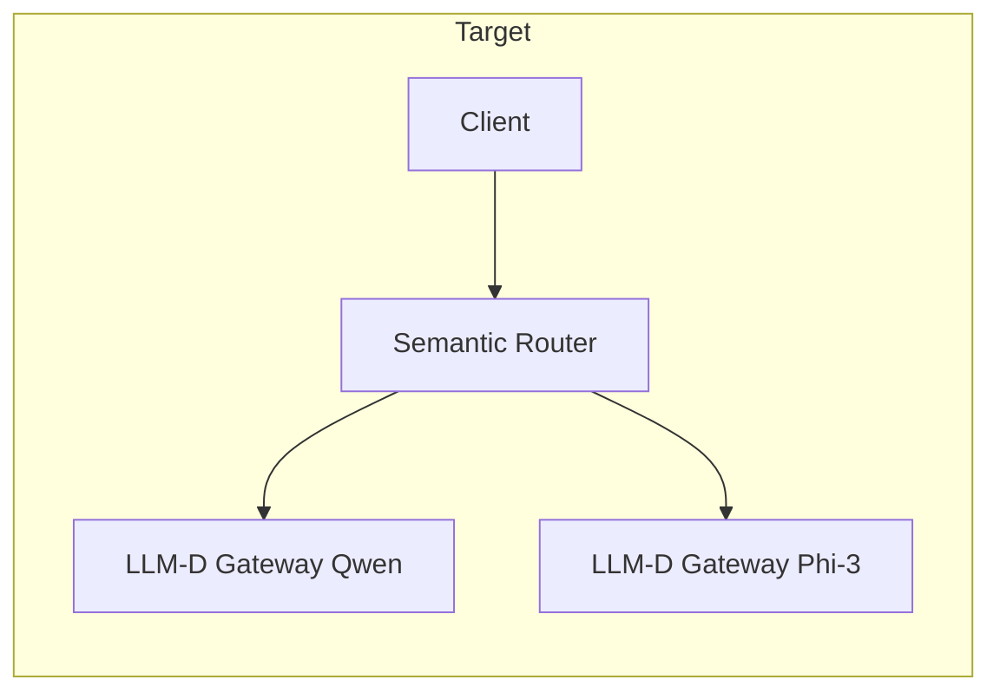

# Semantic Router + LLM-D (Large Language Model Distributed) Integration Plan

**LLM-D** is a community-driven, Kubernetes-native framework for high-performance distributed AI inference, integrated into Red Hat OpenShift AI 3.0. It provides disaggregated prefill/decode, KV-cache-aware routing (inference gateway / EPP), and token-level observability (TTFT, TPOT, cache hit rate). Your **semantic router** does **intent-based** routing (which model: Qwen vs Phi); **LLM-D** does **cache-aware** routing (which replica within a model). The integration keeps the semantic router as the front door and uses LLM-D as the backend for each model.

---

## Current state

- **Models project:** Two KServe InferenceServices — **qwen-25-7b** and **phi-3-mini-chat** — with stable ClusterIP services ([vllm/01-backend-stable-services.yaml](vllm/01-backend-stable-services.yaml)).
- **Semantic router:** Single gateway in `models` namespace (`semantic-router-kserve`) exposing OpenAI-compatible `/v1/chat/completions`. It routes by **intent** (coding/math → Qwen, general → Phi) and enforces safety/PII/jailbreak ([vllm/04-configmap-router.yaml](vllm/04-configmap-router.yaml)).
- **Backends today:** Plain KServe/vLLM predictors; no disaggregated inference or prefix-cache-aware routing.

## Target state

Semantic router stays the single entry point (intent + guardrails). Each model is served by an **LLM-D** stack: disaggregated prefill/decode, inference gateway (EPP) with prefix-cache-aware routing, and observability. Clients still call the semantic router; the router forwards to LLM-D gateways for Qwen and Phi.

---

## Implementation steps

### 1. Prerequisites

- **OpenShift AI 3.0** installed (with support for distributed inference / LLM-D where available).
- **GPU nodes** (e.g. NVIDIA L4/A10) and **NVIDIA GPU Operator** if using GPU for prefill/decode.
- **Namespace:** Use `models` (or a dedicated namespace such as `demo-llm`) for LLM-D components.
- **Reference material:** Red Hat reference repo (e.g. `rh-aiservices-bu/rhaoi3-llm-d`) or [llm-d](https://llm-d.ai/) / [llm-d GitHub](https://github.com/llm-d/llm-d) for Helm/Kustomize manifests and monitoring (Prometheus/Grafana).
- **Image policy (important):** Prefer Red Hat-supported images first.
  - Use images from `registry.redhat.io` when an equivalent exists (for example, vLLM images used in your existing manifests such as `registry.redhat.io/rhaiis/vllm-cuda-rhel9`).
  - Pin by digest where possible for reproducibility.
  - Use upstream images (`ghcr.io`, `quay.io`, Docker Hub) only for components that do not yet have an equivalent Red Hat-provided image.
  - Keep a short compatibility matrix in Git (component, chosen image, source, reason) for auditability.

### 2. Topology decision (selected)

- **Selected flow:** `client -> semantic-router -> LLM-D gateway/modelservice -> model replicas`.
- **Why selected:** Intent classification and guardrails stay at the semantic router first, then LLM-D optimizes replica selection, cache locality, and distributed inference for the chosen model path.
- **Not selected:** `client -> LLM-D -> semantic-router -> model` (adds an extra hop before intent/guardrail decisions and weakens semantic-router-first control).
- **Deployment note:** A single multi-model LLM-D gateway is possible, but this plan proceeds with semantic-router-first forwarding to LLM-D-backed endpoints.

### 3. Deploy LLM-D per model (Qwen and Phi-3)

- Deploy **LLM-D** for **Qwen** and for **Phi-3** in the models project (or chosen namespace). Each deployment typically includes:
  - Disaggregated **prefill** and **decode** services (vLLM-based).
  - **Inference gateway (EPP)** that exposes an OpenAI-compatible API and does prefix-cache-aware routing to prefill/decode replicas.
  - Optional: KV-cache and observability stack (if using reference manifests).
- Use the reference Kustomize/Helm from OpenShift AI 3.0 or llm-d (e.g. `oc apply -k llm-d` for a single model; replicate or parameterize for Qwen and Phi-3).
- Ensure each LLM-D deployment exposes a **stable Service** (e.g. inference gateway) that the semantic router can call (ClusterIP or internal Route). Note the **gateway URL and port** (e.g. `http://<qwen-llm-d-gateway>.models.svc.cluster.local:80/v1` and similarly for Phi).

### 4. Wire semantic router to LLM-D gateways

**File:** [vllm/04-configmap-router.yaml](vllm/04-configmap-router.yaml)

- Update **`vllm_endpoints`** to point to the **LLM-D inference gateway** Services for Qwen and Phi-3 instead of the current KServe predictor ClusterIPs.
  - Replace the current `address`/`port` for `qwen-endpoint` with the LLM-D Qwen gateway Service (e.g. ClusterIP or DNS name and port).
  - Replace the current `address`/`port` for `phi-endpoint` with the LLM-D Phi-3 gateway Service.
- Keep **`model_config`**, **decisions**, **signals**, and **classifier** unchanged so intent routing and guardrails behave as today; only the backend endpoints change from KServe to LLM-D.
- If LLM-D gateways use a different path (e.g. `/v1` only at gateway root), ensure the router's Envoy or extproc forwards to the correct path; the OpenAI-compatible API should remain `/v1/chat/completions` from the router's perspective.

**File (if still used):** [vllm/01-backend-stable-services.yaml](vllm/01-backend-stable-services.yaml)

- Either **remove** the stable Services for the old KServe predictors (if fully migrating to LLM-D) or **add** new stable Services that point to the LLM-D gateways. The semantic router's config must reference the same addresses as in step 2.

### 5. Envoy / router deployment (if needed)

**Files:** [vllm/05-configmap-envoy.yaml](vllm/05-configmap-envoy.yaml), [vllm/06-deployment.yaml](vllm/06-deployment.yaml)

- If the semantic router uses **header-based routing** (e.g. `x-vsr-destination-endpoint`) to send traffic to backend endpoints, ensure the Envoy cluster upstreams are updated to the LLM-D gateway hostnames/ports (or ClusterIPs if you keep the "stable Service" pattern). Update [vllm/05-configmap-envoy.yaml](vllm/05-configmap-envoy.yaml) so the clusters for `qwen-endpoint` and `phi-endpoint` point to the LLM-D gateway Services.
- No change to the semantic router's decision logic (intent, safety) is required; only the backend targets change.

### 6. Observability (optional)

- If using the LLM-D reference stack, deploy the **monitoring** components (e.g. `oc apply -k monitoring` from the reference repo) for Prometheus and Grafana.
- Use LLM-D's token-level metrics (TTFT, TPOT, cache hit rate, prefill vs decode) to validate performance and cache reuse for each model behind the semantic router.

### 7. Validation and migration

- **Curl the semantic router** (as today): `model: "auto"` with coding vs general prompts; confirm responses and `model` in JSON indicate Qwen vs Phi-3.
- **Confirm backend:** Check router and LLM-D gateway logs to ensure requests reach the correct LLM-D gateway and that multi-turn or repeated prompts benefit from cache (e.g. lower TTFT on cache hits).
- **Migration path:** If you need zero-downtime cutover, keep KServe and LLM-D both running; switch `vllm_endpoints` (and Envoy clusters) from KServe to LLM-D in one change, then decommission the old predictors once stable.

### 8. Documentation and GitOps

- In [vllm/README.md](vllm/README.md), add an **"LLM-D integration"** section: backends are LLM-D inference gateways for Qwen and Phi-3; the semantic router performs intent and safety routing; LLM-D provides disaggregated inference and cache-aware routing per model.
- If using Argo CD/Flux, add LLM-D manifests (and any namespace/monitoring) to the GitOps catalog so the full stack is managed from Git.

---

## Summary

| Item | Action |
|------|--------|
| Prerequisites | OpenShift AI 3.0, GPU operator, reference LLM-D manifests (e.g. rhaoi3-llm-d or llm-d), Red Hat images first |
| Topology | Prefer `semantic-router -> LLM-D -> model`; single multi-model LLM-D is possible, per-model LLM-D gives stronger isolation |
| Deploy LLM-D | One LLM-D stack per model (Qwen, Phi-3): prefill/decode + inference gateway (EPP) |
| Router config | Update `vllm_endpoints` in [vllm/04-configmap-router.yaml](vllm/04-configmap-router.yaml) to LLM-D gateway URLs |
| Envoy | Update cluster upstreams in [vllm/05-configmap-envoy.yaml](vllm/05-configmap-envoy.yaml) to LLM-D gateways |
| Backend services | Point [vllm/01-backend-stable-services.yaml](vllm/01-backend-stable-services.yaml) (or equivalent) at LLM-D gateways |
| Validation | Curl router for intent routing; verify LLM-D metrics (TTFT, cache hit) |
| Docs / GitOps | Document LLM-D backends in README; add LLM-D and monitoring to GitOps if used |

---

## Role of each component

- **Semantic router:** Intent-based routing (which **model**: Qwen vs Phi) and guardrails (PII, jailbreak, unsafe content). No change to decision logic.
- **LLM-D (per model):** Disaggregated inference (prefill vs decode), **prefix-cache-aware** routing (which **replica**), and observability. Replaces the current KServe predictor as the backend for that model.
